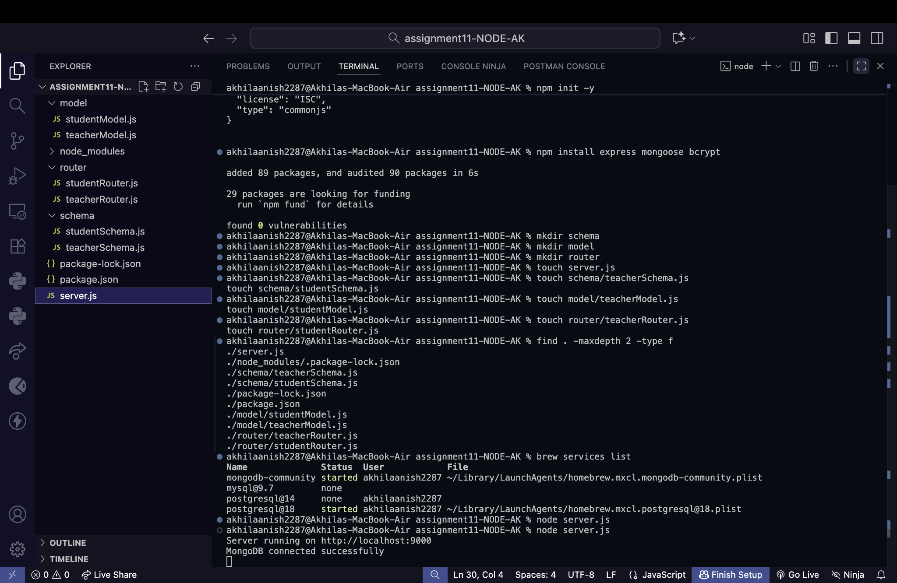
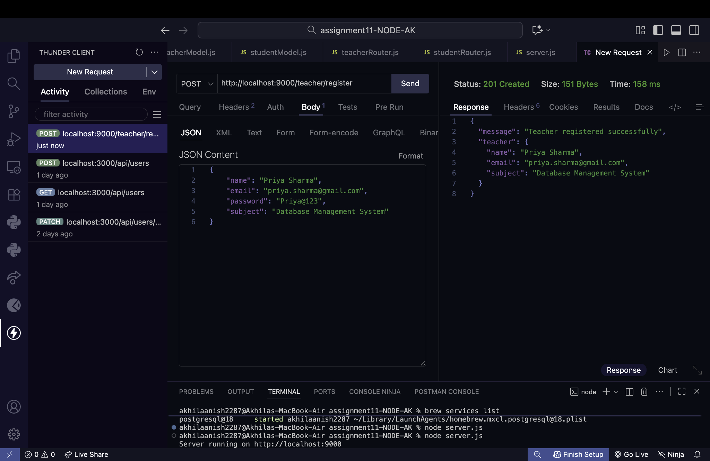
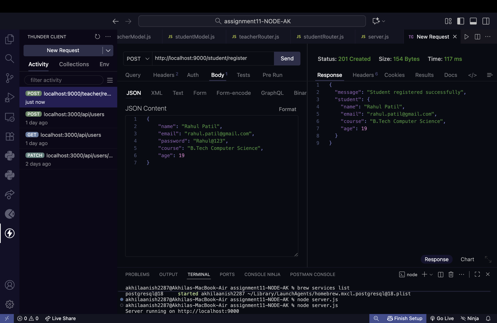
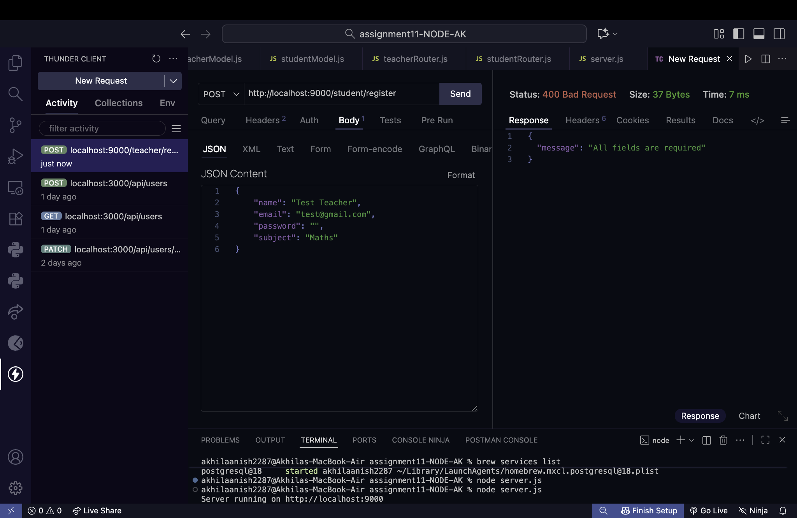
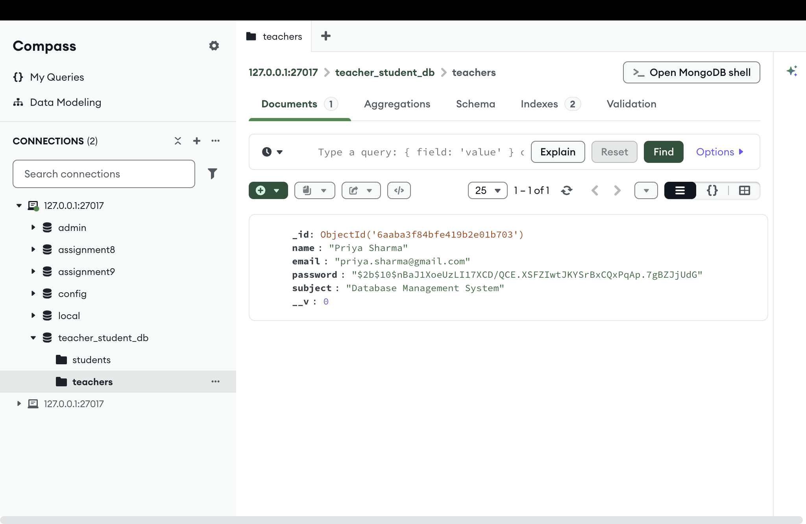
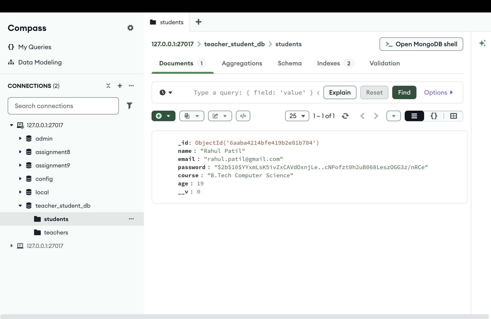

# Teacher & Student Registration System

### Assignment — Express.js + MongoDB + Mongoose

**Student Name:** Akhila Anish Das  
**Roll No:** 150096725016

---

## 📌 Project Overview

This project implements a **Teacher and Student Registration System** using **Node.js, Express.js, MongoDB, Mongoose, and bcrypt**.

The application provides separate registration flows for teachers and students. Each type of user has its own **schema, model, router, and MongoDB collection**. Registration data is validated before storage, passwords are hashed using bcrypt, and the API returns appropriate success or error responses.

The implementation follows the required assignment flow:

> **Request → Validation → Password Hashing → MongoDB Storage → Response**

---

## 🛠️ Technologies Used

| Technology | Purpose |
|---|---|
| **Node.js** | JavaScript runtime environment |
| **Express.js** | Backend framework and REST API |
| **MongoDB** | Database for storing teacher and student records |
| **Mongoose** | MongoDB object modeling and schema management |
| **bcrypt** | Secure password hashing |
| **Thunder Client** | API testing |
| **MongoDB Compass** | Database verification |

---

# 📂 1. Project Structure

The project is organized into separate folders for schemas, models, and routers as required.

```text
project/
│
├── server.js
│
├── schema/
│   ├── teacherSchema.js
│   └── studentSchema.js
│
├── model/
│   ├── teacherModel.js
│   └── studentModel.js
│
└── router/
    ├── teacherRouter.js
    └── studentRouter.js
```

### Screenshot — Project Structure & MongoDB Connection



The screenshot shows the separate `schema`, `model`, and `router` folders along with the server setup. It also shows the application running successfully and MongoDB connected.

---

# 🔌 2. Express.js and MongoDB Connection

The Express.js application is connected to MongoDB using **Mongoose**. The server starts successfully and establishes a connection with the MongoDB database.

The terminal output confirms:

```text
Server running on http://localhost:9000
MongoDB connected successfully
```

This establishes the database connection required for storing teacher and student registration details.

---

# 👨‍🏫 3. Teacher Registration

A separate teacher schema and model are used for teacher registration.

### Teacher Fields

- Name
- Email
- Password
- Subject

The teacher registration API is:

```http
POST /teacher/register
```

### Screenshot — Successful Teacher Registration



The API request successfully registers a teacher and returns:

```text
Status: 201 Created
Teacher registered successfully
```

The response also displays the registered teacher details.

---

# 👨‍🎓 4. Student Registration

A separate student schema and model are used for student registration.

### Student Fields

- Name
- Email
- Password
- Course
- Age

The student registration API is:

```http
POST /student/register
```

### Screenshot — Successful Student Registration



The API successfully registers a student and returns:

```text
Status: 201 Created
Student registered successfully
```

The response contains the registered student's details.

---

# ✅ 5. Registration Data Validation

The application validates registration data before saving it to MongoDB.

For example, when a required password field is left empty, the request is rejected instead of creating an incomplete record.

### Screenshot — Validation Error



The API returns:

```text
Status: 400 Bad Request
"All fields are required"
```

This demonstrates that invalid or incomplete registration data is handled before database storage.

---

# 🔐 6. Password Hashing Using bcrypt

Passwords are **not stored as plain text** in MongoDB. Before a registration is saved, the password is converted into a bcrypt hash.

For example, the database displays a value beginning with:

```text
$2b$10$
```

instead of the original password.

This confirms that the stored password is in **hashed form**.

The teacher and student MongoDB screenshots below both show the hashed password values.

---

# 🗄️ 7. Teacher Data in MongoDB

After successful registration, the teacher record is stored in the dedicated:

```text
teachers
```

collection inside the MongoDB database.

### Screenshot — Teacher Data Stored in MongoDB



The document contains the teacher's:

- `_id`
- `name`
- `email`
- `password` (hashed)
- `subject`

This verifies successful database storage and password hashing for the teacher record.

---

# 🗄️ 8. Student Data in MongoDB

Student registration data is stored separately in the:

```text
students
```

collection.

### Screenshot — Student Data Stored in MongoDB



The document contains the student's:

- `_id`
- `name`
- `email`
- `password` (hashed)
- `course`
- `age`

This verifies successful storage of the student record in its own MongoDB collection.

---

# 🔄 9. Complete Application Flow

### Teacher

```text
POST /teacher/register
        ↓
Teacher Schema Validation
        ↓
Password Hashing using bcrypt
        ↓
teachers Collection
        ↓
Success / Error Response
```

### Student

```text
POST /student/register
        ↓
Student Schema Validation
        ↓
Password Hashing using bcrypt
        ↓
students Collection
        ↓
Success / Error Response
```

---

# 📊 10. Assignment Requirements Completed

| Requirement | Implementation / Evidence |
|---|---|
| Create required folder structure | Separate `schema`, `model`, and `router` files |
| Connect Express.js with MongoDB | Mongoose connection successfully established |
| Create Teacher Schema | Name, Email, Password, Subject |
| Create Student Schema | Name, Email, Password, Course, Age |
| Teacher registration endpoint | `POST /teacher/register` |
| Student registration endpoint | `POST /student/register` |
| Validate registration data | `400 Bad Request` for missing required data |
| Hash passwords | bcrypt-generated hashed passwords |
| Store teacher data | `teachers` MongoDB collection |
| Store student data | `students` MongoDB collection |
| Return responses | Success and validation error responses |

---

# 🧪 11. API Testing Summary

The APIs were tested using **Thunder Client**.

### Teacher API

```http
POST http://localhost:9000/teacher/register
```

**Result:** `201 Created`

### Student API

```http
POST http://localhost:9000/student/register
```

**Result:** `201 Created`

### Validation Test

A registration request with a missing required field was tested.

**Result:** `400 Bad Request`

---

# 🎯 Conclusion

The assignment has been implemented as a complete backend registration system for **teachers and students**.

The project demonstrates:

- Separate schemas, models, and routers
- Express.js REST endpoints
- MongoDB connectivity through Mongoose
- Registration data validation
- bcrypt password hashing
- Separate MongoDB collections for teachers and students
- Successful API responses
- Error handling for invalid registration data
- Database verification using MongoDB Compass
- API testing using Thunder Client

The screenshots included above provide visual evidence of the **project structure, MongoDB connection, successful teacher registration, successful student registration, validation, and database storage with hashed passwords**.
